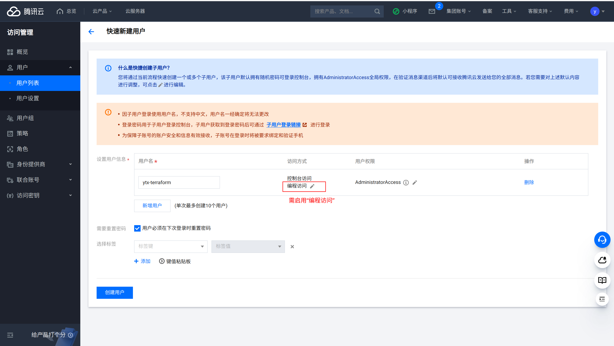

# 使用 Terraform 创建腾讯云 CVM 机器

## 准备工作

### 安装 Terraform

本人的机器是 Ubuntu 22.04 LTS，参考[这篇文档](https://developer.hashicorp.com/terraform/install)安装 Terraform。

```bash
wget -O- https://apt.releases.hashicorp.com/gpg | sudo gpg --dearmor -o /usr/share/keyrings/hashicorp-archive-keyring.gpg
echo "deb [signed-by=/usr/share/keyrings/hashicorp-archive-keyring.gpg] https://apt.releases.hashicorp.com $(lsb_release -cs) main" | sudo tee /etc/apt/sources.list.d/hashicorp.list
sudo apt update && sudo apt install terraform
```

### 在腾讯云控制台创建子用户

1. 登录腾讯云控制台。
2. 创建子用户：

    进入 **访问管理 → 用户 → 用户列表**，点击 **新建用户**，选择 **快速创建**。

    * 访问方式应启用 **编程访问**。
    * 创建好的用户将会拥有密钥 `SecretId` 和 `SecretKey`。

    
3. 创建用户成功。

    * 请务必保存用户名、密码和密钥信息，否则将不能再次获取。

    

# 本地运行 `terraform init`

1. 在此仓库中新建一个 [`configs`](../configs/) 目录。
2. 在 `configs` 目录下，创建配置文件：

    * [`provider.tf`](../configs/provider.tf)

        ```tf
        terraform {
            required_providers {
                tencentcloud = {
                    source = "tencentcloudstack/tencentcloud"
                }
            }
        }

        # Cretentials are stored as environment variables,
        # provided by ./credentials/tencent-cloud.env
        provider "tencentcloud" {
        }
        ```
    * `tencent-cloud.env`（存储 secret key 环境变量信息，不应提交到 git 仓库）

        ```env
        TENCENTCLOUD_SECRET_ID=xxxxxxxxxx
        TENCENTCLOUD_SECRET_KEY=xxxxxxxxxx
        TENCENTCLOUD_REGION="ap-guangzhou"
        ```
    * [`export-tencent-cloud-credentials.sh`](../configs/credentials/export-tencent-cloud-credentials.sh)

        ```bash
        #!/usr/bin/env bash

        CURRENT_DIR=$(dirname "$(realpath "${BASH_SOURCE[0]}")")

        . "$CURRENT_DIR/tencent-cloud.env"
        ```

3. 在 `configs` 目录下，运行 `terraform init`。

    ```bash
    . ./credentials/export-tencent-cloud-credentials.sh
    terraform init
    ```

    创建后会出现一个 `.terraform` 目录，以及一个 `.terraform.lock.hcl` 文件。（`.terraform` 目录内容过多，已经 gitignore 掉）

    出现以下内容即为成功：

    ```
    Initializing the backend...

    Initializing provider plugins...
    - Finding latest version of tencentcloudstack/tencentcloud...
    - Installing tencentcloudstack/tencentcloud v1.81.59...
    - Installed tencentcloudstack/tencentcloud v1.81.59 (signed by a HashiCorp partner, key ID 84F69E1C1BECF459)

    Partner and community providers are signed by their developers.
    If you'd like to know more about provider signing, you can read about it here:
    https://www.terraform.io/docs/cli/plugins/signing.html

    Terraform has created a lock file .terraform.lock.hcl to record the provider
    selections it made above. Include this file in your version control repository
    so that Terraform can guarantee to make the same selections by default when
    you run "terraform init" in the future.

    Terraform has been successfully initialized!

    You may now begin working with Terraform. Try running "terraform plan" to see
    any changes that are required for your infrastructure. All Terraform commands
    should now work.

    If you ever set or change modules or backend configuration for Terraform,
    rerun this command to reinitialize your working directory. If you forget, other
    commands will detect it and remind you to do so if necessary.
    ```