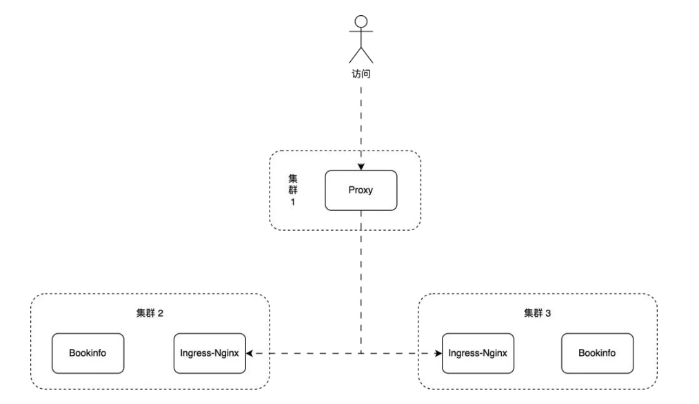

# 极客时间 云原生DevOps进阶实战营 大作业

## 训练营课程大作业

（本次作业是必交的作业，请打包以下代码以供助教检查）

1. 使用 Terraform 开通一台腾讯云 CVM, 安装 K3s(集群 1), 并在集群 1 内安装 Jenkins、Argo CD
2. 书写 Terraform lac 代码: 开通两台腾讯云 CVM, 分别安装 K3s(集群 2、集群 3), 并实现以下要求:
    * 使用集群 1 作为 Terraform Kubernetes backend 后端存储
    * 将 laC 源码存储在 GitHub 代码仓库中
    * 在集群 1 的 Jenkins 中配置流水线, 实现在 lac 代码变更时自动触发变更 (Jenkinsfile)
3. 在集群 1 的 Argo CD 实例中添加集群 2、3
4. 使用一个 ApplicationSet +List Generators 在集群 2、集群 3 内的 default 命名空间下同时部署示例应用 Bookinfo(Helm Chart 源码见: iac/lastwork/bookinfo)
5. 示例应用部署完成后，实现以下架构：

    

## 备注

这是一个理想的多云灾备部署场景, 集群 1、2、3 可能分别部署在不同云厂商。集群 1 的 Proxy 作为流量入口对外提供服务，对部署在集群 2 和集群 3 的无状态示例应用 Bookinfo 做负载均衡。

## 得分判定标准

1. 能在集群 1 对集群 2 和集群 3 实现流量负载均衡 (加权轮询) 即为及格。
2. 能在集群 1 感知集群 2 和集群 3 服务健康状态, 并实现 Proxy 自动故障转移即为优秀。
3. 集群 1 的 Proxy 可选 Ingress-Nginx、Traefik、APISIX、HAProxy 等，但要求部在 K8s 集群。

## 作业提交方式

1. 将作业推送到 Gitee 或者 GitHub 上，然后把链接，提交在下方的作业提交框内，点击提交即可。
2. 关注“极客时间训练营”公众号作业批改完成会有消息提示。