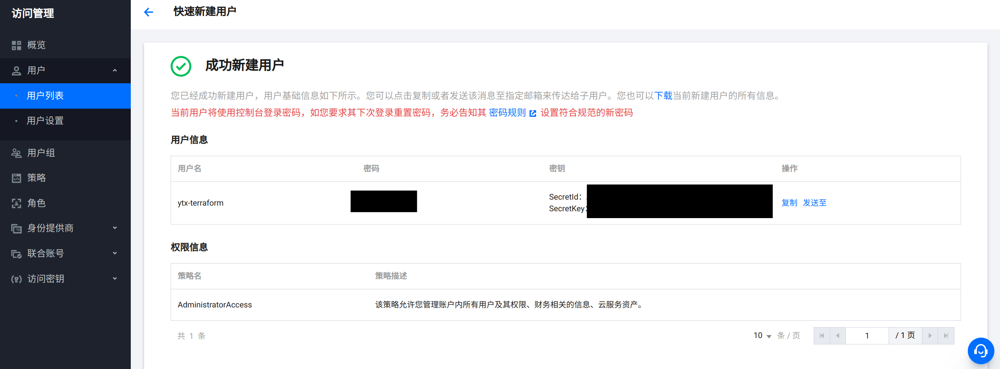

# 大作业完成步骤

## 准备工作

### 安装 Terraform

本人的机器是 Ubuntu 22.04 LTS，参考[这篇文档](https://developer.hashicorp.com/terraform/install)安装 Terraform。

```bash
wget -O- https://apt.releases.hashicorp.com/gpg | sudo gpg --dearmor -o /usr/share/keyrings/hashicorp-archive-keyring.gpg
echo "deb [signed-by=/usr/share/keyrings/hashicorp-archive-keyring.gpg] https://apt.releases.hashicorp.com $(lsb_release -cs) main" | sudo tee /etc/apt/sources.list.d/hashicorp.list
sudo apt update && sudo apt install terraform
```

### 在腾讯云控制台创建子用户

1. 登录腾讯云控制台。
2. 创建子用户：

    进入 **访问管理 → 用户 → 用户列表**，点击 **新建用户**，选择 **快速创建**。

    * 访问方式应启用 **编程访问**。
    * 创建好的用户将会拥有密钥 `SecretId` 和 `SecretKey`。

    
3. 创建用户成功。

    * 请务必保存用户名、密码和密钥信息，否则将不能再次获取。

    

## Terraform 初始化操作：创建 CVM 实例，安装 Jenkins、Argo CD、Crossplane、ingress-nginx

在 Terraform 工作目录 [`terraform`](./terraform/) 下，执行

```bash
# 设置 secret id 和 secret key
. ./credentials/export-tencent-cloud-credentials.sh

# 初始化
terraform init

# 部署集群
terraform apply --auto-approve
```

执行完成后，SSH 进入创建好的实例，执行

```bash
kubectl get providers
```

参考输出如下：

```
NAME                 INSTALLED   HEALTHY   PACKAGE                                              AGE
provider-terraform   True        True      xpkg.upbound.io/upbound/provider-terraform:v0.11.0   10h
```

## 登录 Jenkins 界面，进行配置

这里配置的域名是 [jenkins.devops.ytx139.bid](http://jenkins.devops.ytx139.bid)。

登录后，创建一个项目 **devops**，使用**多分支流水线**。

